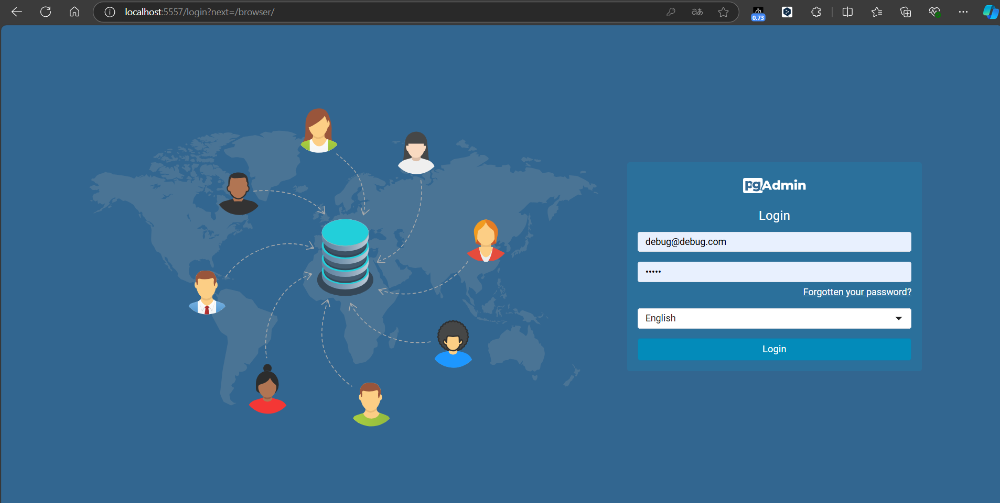
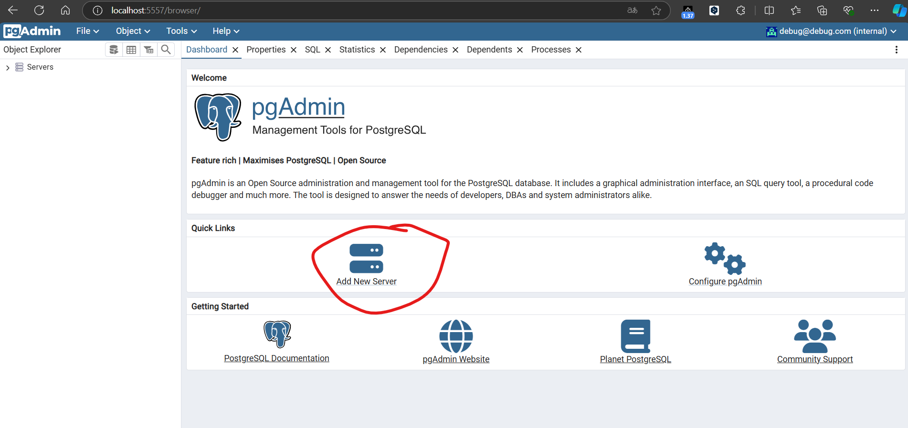
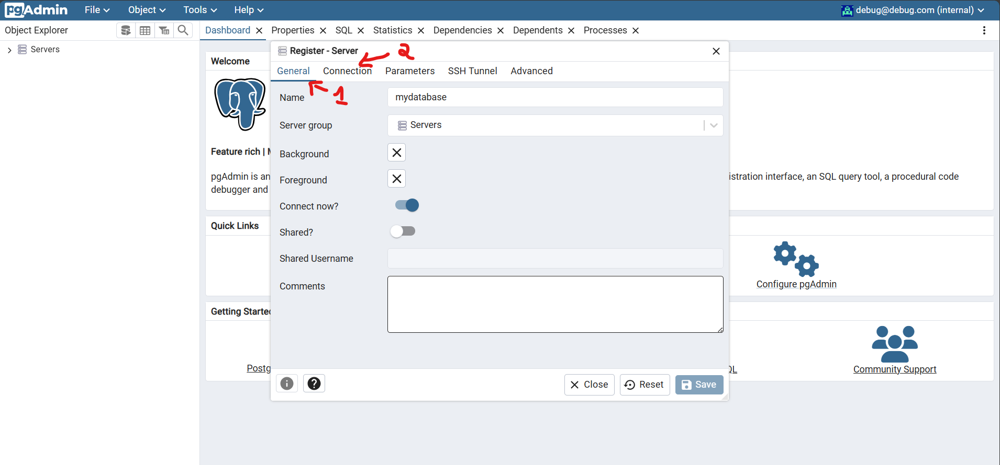
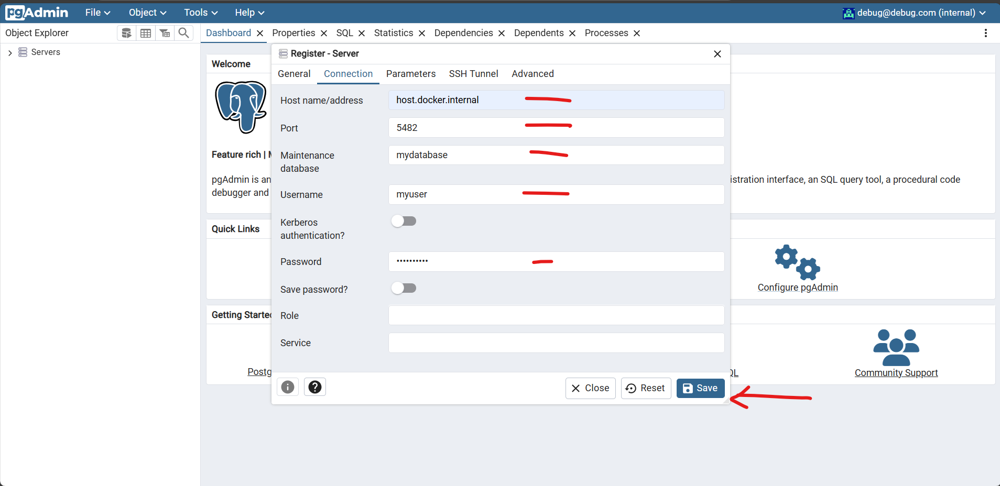
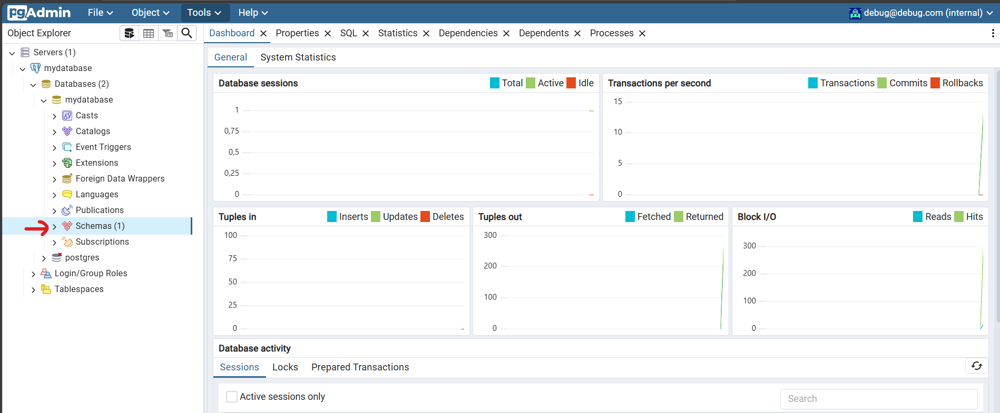
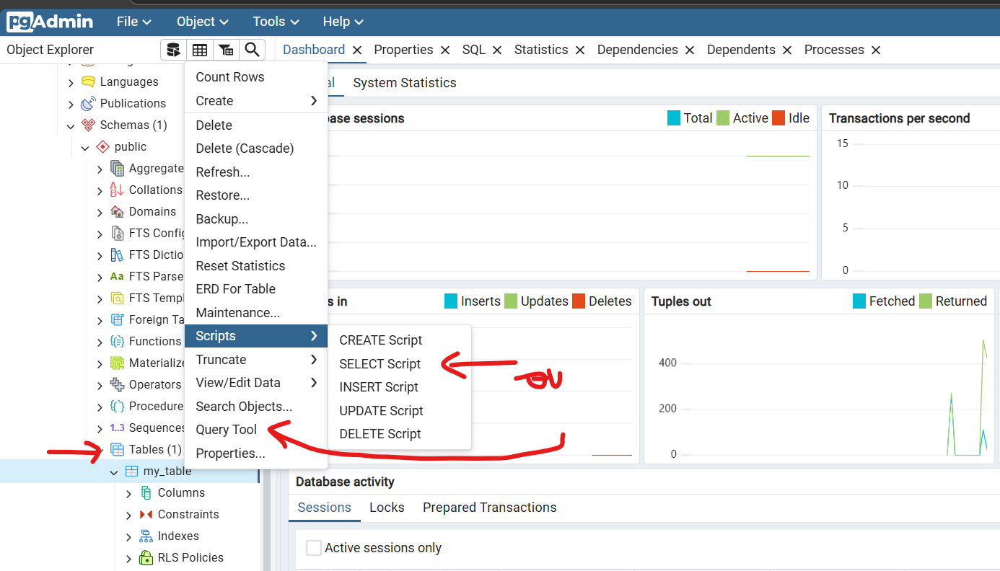
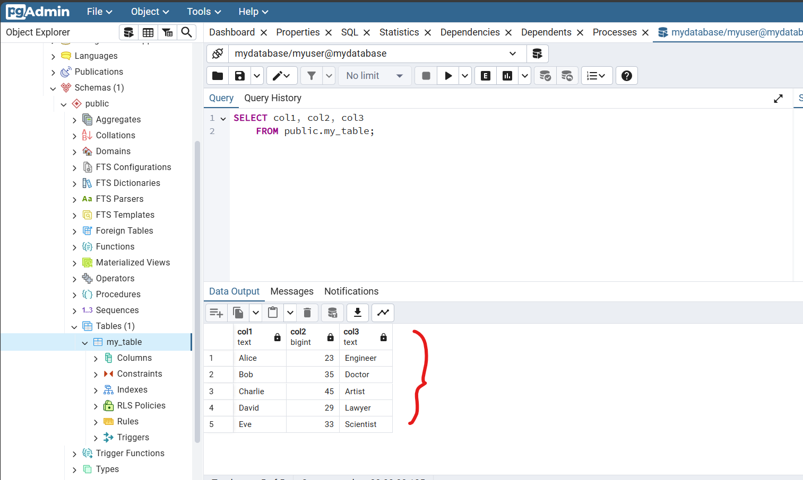

# Accès à la Base de Données via pgAdmin

pgAdmin est une interface graphique pour gérer et administrer des bases de données PostgreSQL. Voici comment y accéder et l'utiliser avec notre projet.

## Prérequis

Avant de commencer, assurez-vous que les éléments suivants sont en place :

- **Docker** : Vous devez avoir Docker et Docker Compose installés.
- **Conteneurs en cours d'exécution** : Assurez-vous que vos conteneurs PostgreSQL et pgAdmin sont en cours d'exécution.

## Étape 1 : Accéder à pgAdmin

1. **Ouvrez votre navigateur web**.
2. **Naviguez vers** : `http://localhost:9026` (ou l'adresse IP de votre serveur Docker si vous n'êtes pas en local).

## Étape 2 : Se connecter à pgAdmin

1. **Identifiants de connexion** :
   - **Email** : `debug@debug.com`
   - **Mot de passe** : `debug`

   Ces identifiants sont définis dans le fichier `docker-compose.yml` du projet.

2. **Ajouter un serveur** :
   - Après la connection, cliquez sur "Add New Server" (Ajouter un nouveau serveur) dans le tableau de bord de pgAdmin.
   - Dans l'onglet "General", donnez un nom à votre serveur (par exemple, `PostgreSQL Server`).
   

3. **Configurer la connexion** :
   - Allez à l'onglet "Connection".
   - **Host** : `host.docker.internal` (C'est une méthode pratique pour établir une communication entre un `conteneur Docker` et les services de la machine hôte).
   - **Port** : `5482` (Le port externe exposé sur la machine hôte).
   - **Username** : `myuser`
   - **Password** : le mot de passe de l'utilisateur PostgreSQL défini dans le fichier `docker-compose.yml`.

4. **Enregistrer** : Cliquez sur "Save" pour ajouter le serveur.

## Étape 3 : Explorer la Base de Données

Une fois connecté, vous pourrez voir votre base de données dans le volet de navigation à gauche. Cliquez sur le nom de la base de données pour explorer ses tables, vues, et autres objets.

## Étape 4 : Exécuter des Requêtes SQL

Vous pouvez exécuter des requêtes SQL en allant dans l'onglet "Query Tool" (Outil de requête) :

1. Cliquez sur le bouton "Tools" dans le menu supérieur.
2. Sélectionnez "Query Tool".
3. Écrivez vos requêtes dans l'éditeur et cliquez sur "Execute" (Exécuter) pour voir les résultats.

## Conclusion

pgAdmin est un outil puissant qui facilite la gestion de vos bases de données PostgreSQL. Utilisez-le pour explorer, administrer, et exécuter des requêtes sur vos données.
